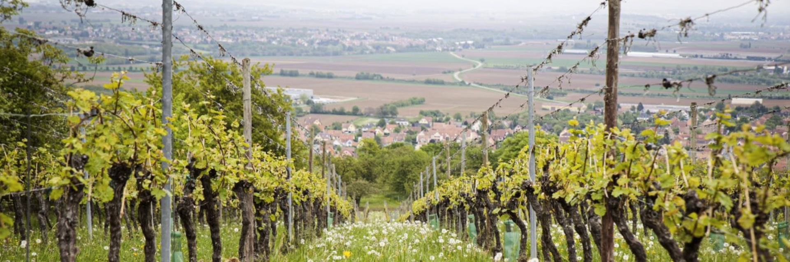

# Où je vis > Ma région

## 🏞️ L’Alsace : Une région pleine de caractère

Comment ça, on doit dire “Grand Est” maintenant ? 🤨 Non, l’Alsace, c’est une identité forte, entre traditions bien ancrées et ouverture sur l’Europe. Française ? Allemande ? Les deux ? Tout dépend du moment de l’Histoire où on pose la question… et de l’intonation du “Hopla !” lancé au marché. Connue pour ses marchés de Noël féeriques, ses paysages vallonnés et son patrimoine unique, l’Alsace a cette petite touche magique qui en fait une région à part. Et soyons honnêtes, rien que pour le vin blanc et la tarte flambée, ça vaut le détour ! 🍷🔥

***

## Sommaire
- ### [Accueil](./index.md)
- ### [Ma ville](./ma-ville.md)
- ### [Mon département](./mon-departement.md)

***

> “Là où je vis, les murs ont des oreilles et les oreilles traînent.”