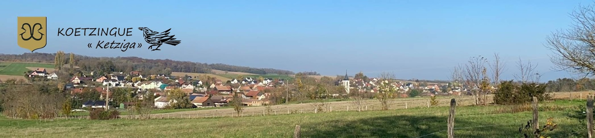

# Où je vis > Ma ville

## 🏡 Koetzingue : Un petit village avec du caractère

Situé en plein cœur du Sundgau, Koetzingue est un char… petit village alsacien. Avec ses paysages verdoyants, ses maisons traditionnelles et son ambiance paisible, c’est l’endroit rêvé pour qui aime l’enn… la tranquillité et les spécialités du terroir… enfin, du terroir italien, surtout. Parce que oui, ici, le seul commerce du village est un restaurant italien. Si c’est pas l’ouverture sur le monde, ça ? 🇮🇹

***

## Sommaire
- ### [Accueil](./index.md)
- ### [Mon département](./mon-departement.md)
- ### [Ma région](./ma-region.md)

***

> “Là où je vis, les murs ont des oreilles et les oreilles traînent.”