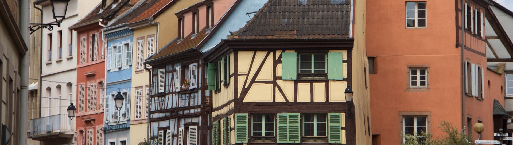

# Où je vis > Mon département

## 📍 Haut-Rhin : Entre nature et patrimoine

Le Haut-Rhin, c’est un savant mélange entre villages pittoresques, montagnes vosgiennes et villes animées (et parfois, lors du passage à la nouvelle année, littéralement en feu 🔥) comme Mulhouse ou Colmar. Entre la Route des Vins, les crêtes des Vosges et les innombrables cigognes photogéniques, ce département a de quoi séduire aussi bien les amoureux de nature que les passionnés d’histoire. Et bien sûr, impossible de parler du Haut-Rhin sans évoquer sa gastronomie : choucroute, bretzels, munster… Tout ce qu’il faut pour compenser l’absence de palmiers et de plages 🏝️.

***

## Sommaire
- ### [Accueil](./index.md)
- ### [Ma ville](./ma-ville.md)
- ### [Ma région](./ma-region.md)

***

> “Là où je vis, les murs ont des oreilles et les oreilles traînent.”